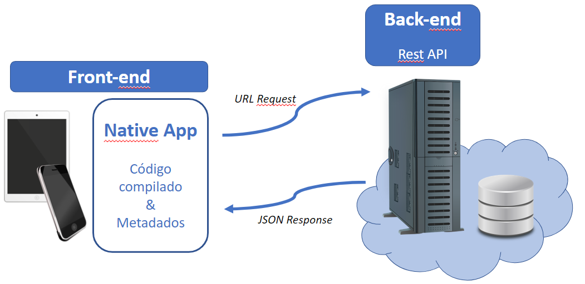
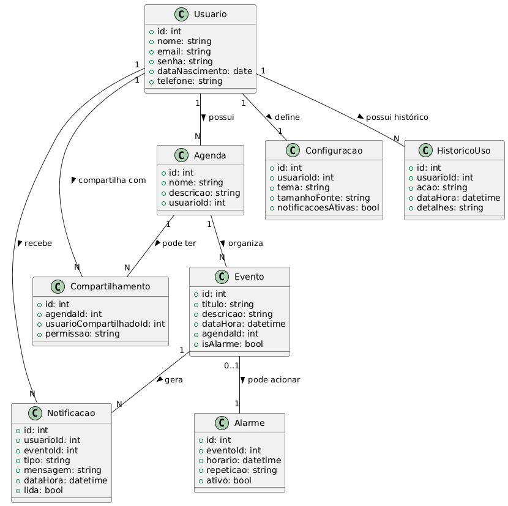

# Arquitetura da Solução

Pré-requisitos: <a href="3-Projeto de Interface.md"> Projeto de Interface</a>

Definição de como o software é estruturado em termos dos componentes que fazem parte da solução e do ambiente de hospedagem da aplicação.

## Diagrama de Classes

## Modelo ER

O Modelo ER representa através de um diagrama como as entidades (coisas, objetos) se relacionam entre si na aplicação interativa.]

As referências abaixo irão auxiliá-lo na geração do artefato “Modelo ER”.

## Esquema Relacional

O Esquema Relacional corresponde à representação dos dados em tabelas juntamente com as restrições de integridade e chave primária.
 
As referências abaixo irão auxiliá-lo na geração do artefato “Esquema Relacional”.

## Modelo Físico

Entregar um arquivo banco.sql contendo os scripts de criação das tabelas do banco de dados. Este arquivo deverá ser incluído dentro da pasta src\bd.

## Tecnologias Utilizadas

Descreva aqui qual(is) tecnologias você vai usar para resolver o seu problema, ou seja, implementar a sua solução. Liste todas as tecnologias envolvidas, linguagens a serem utilizadas, serviços web, frameworks, bibliotecas, IDEs de desenvolvimento, e ferramentas.

Apresente também uma figura explicando como as tecnologias estão relacionadas ou como uma interação do usuário com o sistema vai ser conduzida, por onde ela passa até retornar uma resposta ao usuário.

## Hospedagem

Explique como a hospedagem e o lançamento da plataforma foi feita.

> **Links Úteis**:
>
> - [Website com GitHub Pages](https://pages.github.com/)
> - [Programação colaborativa com Repl.it](https://repl.it/)
> - [Getting Started with Heroku](https://devcenter.heroku.com/start)
> - [Publicando Seu Site No Heroku](http://pythonclub.com.br/publicando-seu-hello-world-no-heroku.html)

## Qualidade de Software

## Aplicação da ISO/IEC 25010 ao Projeto

### 1. Características e Subcaracterísticas Selecionadas

1. **Usabilidade – Aprendizagem e Operabilidade**

   * **Justificativa:** O público-alvo principal são idosos, muitos com dificuldades motoras ou cognitivas. A interface deve ser extremamente simples, intuitiva e acessível.
   * **Métricas:**

     * Percentual de tarefas concluídas sem erro (meta ≥ 90%).
     * Número médio de toques para criar um alarme (meta ≤ 4).
     * Tempo médio de aprendizado para configurar o primeiro lembrete (meta ≤ 5 minutos).

2. **Acessibilidade (parte da Usabilidade, destacada pelo contexto do projeto)**

   * **Justificativa:** O app deve atender requisitos específicos de acessibilidade: botões grandes, contraste adequado, suporte a texto ampliado, vibração longa e feedback háptico.
   * **Métricas:**

     * Conformidade com diretrizes WCAG 2.1 nível AA.
     * Percentual de usuários idosos que conseguem utilizar o app sem ajuda (meta ≥ 80%).

3. **Confiabilidade – Disponibilidade e Tolerância a Falhas**

   * **Justificativa:** O aplicativo lida com lembretes críticos de saúde (medicação/consultas). Falhas podem trazer riscos sérios.
   * **Métricas:**

     * Disponibilidade mínima de 99% por mês.
     * Taxa de falhas no disparo de alarmes ≤ 0,5% em 30 dias.

4. **Segurança – Confidencialidade e Integridade**

   * **Justificativa:** O app manipula informações pessoais e precisa respeitar a LGPD. Além disso, deve proteger contra acessos indevidos (revogação de acompanhantes, PIN/biometria).
   * **Métricas:**

     * Percentual de dados sensíveis transmitidos de forma criptografada (meta 100%).
     * Tempo de revogação de acesso de um acompanhante (meta: imediato).
     * Número de vulnerabilidades críticas encontradas em testes (meta: 0).

5. **Compatibilidade – Interoperabilidade**

   * **Justificativa:** O aplicativo deve funcionar em diferentes versões de Android (8.0+) e tamanhos de tela, além de integrar-se a funcionalidades nativas (ex.: mapas, notificações).
   * **Métricas:**

     * Percentual de dispositivos testados nos quais o app roda sem falhas (meta ≥ 95%).
     * Tempo médio para abrir integração com o app de mapas (meta ≤ 3 segundos).

6. **Eficiência de Desempenho – Tempo de Resposta e Utilização de Recursos**

   * **Justificativa:** O disparo de alarmes deve ser imediato e o app precisa consumir poucos recursos (bateria e memória), pois muitos idosos usam aparelhos simples.
   * **Métricas:**

     * Tempo de disparo do alarme após o horário configurado (meta ≤ 5s).
     * Consumo médio de bateria (meta: ≤ 3% em 24h de uso regular).

7. **Manutenibilidade – Modularidade e Testabilidade**

   * **Justificativa:** O app terá evolução em versões futuras (ex.: comandos de voz, nuvem, relatórios mais avançados). A arquitetura deve facilitar manutenção e testes.
   * **Métricas:**

     * Cobertura de testes automatizados nos módulos críticos (meta ≥ 70%).
     * Tempo médio para corrigir um defeito crítico (meta ≤ 48h).

---

### 2. Conclusão

A equipe definiu que as subcaracterísticas prioritárias para este software são:

* **Usabilidade e Acessibilidade** (facilitar uso pelos idosos).
* **Confiabilidade e Segurança** (garantir lembretes de saúde e privacidade).
* **Compatibilidade e Eficiência** (funcionar bem em diversos dispositivos com baixo consumo de recursos).
* **Manutenibilidade** (facilitar evolução futura do projeto).

Essas escolhas refletem diretamente o problema e os objetivos do projeto, garantindo que o aplicativo atenda às necessidades de idosos e seus acompanhantes com qualidade, acessibilidade e segurança.
